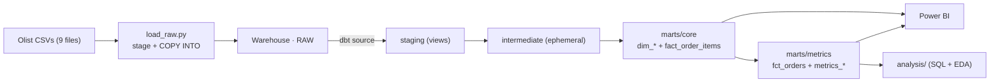
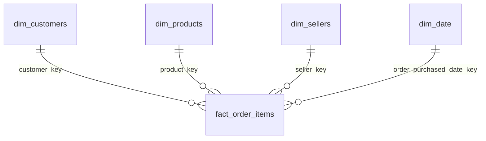

# Retail Analytics Engineering Pipeline

> **Built and maintained dbt models that transform raw retail transaction data
> into trusted, tested and documented analytical datasets.**

An end-to-end analytics engineering project on the [Brazilian E-Commerce
(Olist)](https://www.kaggle.com/datasets/olistbr/brazilian-ecommerce) public
dataset: raw CSVs → cloud warehouse → dbt staging → a tested dimensional model →
a reusable metrics layer → BI. Built to be cloned, run, tested and extended by
another engineer — not as a tutorial.

*This is a portfolio project. It uses a public dataset and is not affiliated
with Olist.*

---

## What a reviewer should take away in two minutes

| | |
|---|---|
| **Warehouse** | Snowflake (primary) with an identical local **DuckDB** target so the whole pipeline builds and tests with zero credentials |
| **Transformation** | **dbt 1.9** — 8 staging + 2 intermediate + 5 dimensional/fact + 7 metric models |
| **Dimensional model** | Star schema, `fact_order_items` at **one row per order line item**, grain and measure-additivity documented, fanout guarded by tests |
| **Testing** | **144 tests, 143 pass, 1 documented warn, 0 errors** — generic + 6 singular business-rule tests |
| **Docs** | `dbt docs` site, data dictionary, metrics definitions, architecture + ERD + lineage diagrams, data-quality register |
| **Metrics layer** | KPI logic defined once in dbt (revenue, AOV, on-time %, cancellation rate, RFM…) so BI needs almost no DAX |
| **BI** | Power BI spec + connection guide + star-schema model + page-by-page visual layout |
| **Analysis** | 8 quantified business findings with recommendations, every number traceable to a query |
| **Reproducibility** | `git clone` → `make image` → `make data` → `make load` → `make build-all` |

---

## Business problem

Olist is a marketplace connecting small Brazilian sellers to large storefronts.
The raw data is 9 normalised CSVs — you cannot answer "what's our revenue by
category?" or "is late delivery hurting reviews?" without joining 4–6 tables and
making a dozen grain decisions correctly. This project builds the **trusted
layer** that makes those questions a single `SELECT`, and proves it is correct
with tests.

### Objectives

1. Load the raw dataset into a cloud warehouse reproducibly.
2. Model it as a documented star schema with an explicit fact grain.
3. Test every assumption that revenue depends on.
4. Define KPIs once, in version control.
5. Ship a BI-ready model and surface real insights.

---

## Architecture



Full detail: [`docs/architecture.md`](docs/architecture.md) ·
[`docs/data-model.md`](docs/data-model.md) ·
[`docs/lineage.md`](docs/lineage.md)

### Tech stack

| Layer | Tool |
|---|---|
| Warehouse | **Snowflake** · **DuckDB** (local/CI mirror) |
| Transformation | **dbt-core 1.9**, `dbt_utils`, `codegen` |
| Ingestion | Python (`load_raw.py`), Snowflake stages + `COPY INTO`, Kaggle API |
| Runtime | **Docker** (pinned Python 3.11 — host runs 3.14) |
| BI | Power BI |
| Orchestration entrypoints | `make` |
| Lint | `sqlfluff` |

---

## Data model

**Star schema.** `fact_order_items` — **grain: one row per order line item**
`(order_id, order_item_number)`, surrogate key `order_item_key`.



- **Additive measures:** `item_price`, `freight_value`, `item_total_value`,
  `item_quantity`, `allocated_payment_value`.
- **Order-level measures** (repeated per line — average per order, never sum
  across lines): `delivery_days`, `delivery_delay_days`, `review_score`.
- **Fanout control:** payments pre-aggregated to order grain, reviews de-duped to
  one per order, before joining. Enforced by `assert_fact_not_fanned_out` and
  `assert_revenue_reconciles_across_grains`.
- **SCD:** all dimensions Type 1 (current value); rationale and the Type-2
  candidates in [`docs/data-model.md`](docs/data-model.md).

`dim_date` is generated (`dbt_utils.date_spine`) with year / quarter / month
(+name) / week / day / day-of-week / weekend flag.

---

## Models

| Staging (`view`) | Intermediate (`ephemeral`) | Marts / core (`table`) | Marts / metrics (`view`) |
|---|---|---|---|
| `stg_orders` | `int_order_reviews` | `dim_customers` | `fct_orders` |
| `stg_order_items` | `int_payments_by_order` | `dim_products` | `metrics_orders_daily` |
| `stg_order_payments` | | `dim_sellers` | `metrics_category_performance` |
| `stg_order_reviews` | | `dim_date` | `metrics_seller_performance` |
| `stg_customers` | | `fact_order_items` | `metrics_delivery_performance` |
| `stg_products` | | | `metrics_customer_rfm` |
| `stg_sellers` | | | `metrics_executive_summary` |
| `stg_geolocation` | | | |

Staging does **light work only** — rename, cast, parse timestamps, translate
category, collapse geolocation to one point per zip prefix. Business logic lives
in marts/metrics.

---

## Testing strategy

`dbt build` → **`PASS=143  WARN=1  ERROR=0`** (144 tests) on the DuckDB target.

- **Generic (124):** `not_null` / `unique` on every key, `relationships` on
  every FK, `accepted_values` on status/score/region/segment domains,
  `accepted_range` on financials, `unique_combination_of_columns` on the fact
  grain. Applied where a business expectation justifies them — not blanket.
- **Singular (6):** non-negative financials · delivery not before purchase ·
  delivered orders have a delivery date *(warn — a known 8-row Olist issue)* ·
  revenue reconciles across grains · fact not fanned out · payment allocation
  ties to order total.
- The **1 warning is a real, documented property of the source data**, kept
  visible on purpose. Register: [`docs/data-quality.md`](docs/data-quality.md).

---

## KPI / metrics definitions

Defined once in the `metrics` layer, documented in
[`docs/metrics.md`](docs/metrics.md). Revenue = `SUM(item_price)` over orders in
`{delivered, shipped, invoiced}` (a dbt var). Includes Revenue, Orders, Items
Sold, AOV, Delivery Time, Delivery Delay, On-Time Delivery %, Cancellation Rate,
Revenue by Category, Seller Revenue, RFM segments.

---

## Performance

Materialisation chosen per layer (views for thin staging, tables for
BI-facing marts, ephemeral for intermediates); geolocation collapsed from ~1M to
~19k rows before any join; date dimension generated not scanned; portable date
math via dbt macros. Full rationale + trade-offs:
[`docs/performance.md`](docs/performance.md). Incremental models deliberately not
used (full build ~2s) — with the switch-over documented.

---

## Key business insights

From [`analysis/business-insights.md`](analysis/business-insights.md) (every
figure traceable to [`analysis/run_eda.py`](analysis/run_eda.py)):

1. Marketplace revenue grew **~4× from 2017 Q1 to 2018 Q2**; AOV flat at ~137 BRL
   — growth is new orders, not bigger baskets.
2. **Southeast Brazil = 65% of revenue**; **top 100 sellers (3%) = 45% of
   revenue** — concentrated on one region and a few sellers.
3. **On-time orders average a 4.29 review; late orders 2.57** — late delivery is
   the strongest driver of bad reviews. On-time rate dropped to **77% in Mar
   2018** (operational incident).
4. Reviews are bimodal (58% 5-star, 14% 1–2 star); **`bed_bath_table`** is the
   3rd-biggest category but one of the worst reviewed (3.90) — a bulky-goods /
   freight problem (freight is **16.6% of product revenue**).
5. **Only 3.1% of customers ever reorder** — acquisition, not retention, drove
   all growth; cohort retention is the priority follow-up.

---

## Project setup

### Prerequisites
Docker Desktop, `make`, a Kaggle account (for the dataset), optionally a
Snowflake account.

### Run it locally (DuckDB — no credentials)

```bash
git clone <your-fork-url> retail-analytics-engineering
cd retail-analytics-engineering

make image                       # build the dbt Docker image

# dataset — put a Kaggle token at ~/.kaggle/kaggle.json first (see DATA_SETUP.md)
make data                        # download Olist CSVs -> data/raw/
make load                        # load -> DuckDB RAW schema, validate row counts

make deps                        # dbt packages
make build-all                   # dbt build  (run + test)  -> PASS=143 WARN=1
make docs                        # dbt docs generate

docker compose run --rm dbt python /workspace/analysis/run_eda.py   # insights
```

### Run it on Snowflake
Follow [`SNOWFLAKE_SETUP.md`](SNOWFLAKE_SETUP.md), then any command with
`make DBT_TARGET=snowflake <goal>`.

### Command reference

| `make` goal | Action |
|---|---|
| `image` | build the dbt container |
| `data` / `load` | download / load the raw dataset |
| `debug` | `dbt debug` (connection check) |
| `deps` / `seed` / `run` / `test` | individual dbt steps |
| `build-all` | `dbt build` (run + test in one DAG pass) |
| `docs` | `dbt docs generate` |
| `shell` | shell inside the container |
| `clean` | remove `target/`, packages, local DuckDB file |

---

## Repository layout

```
├── dbt/
│   ├── models/staging/        stg_*  + _sources.yml
│   ├── models/intermediate/   int_*  (ephemeral)
│   ├── models/marts/core/     dim_*, fact_order_items
│   ├── models/marts/metrics/  fct_orders, metrics_*
│   ├── macros/                brazil_region, date_to_key, status_list
│   ├── tests/                 6 singular business-rule tests
│   └── snapshots/             (scaffold for Type-2, see data-model.md)
├── scripts/                   load_raw.py, download_data.sh, snowflake/*.sql
├── analysis/                  run_eda.py, business-insights.md, queries/
├── dashboard/                 Power BI spec + connection guide
├── docs/                      architecture, data-model, metrics, data-dictionary,
│                              data-quality, performance, lineage
├── data/                      README (raw data is git-ignored)
├── Dockerfile · docker-compose.yml · Makefile · requirements.txt
└── .env.example
```

---

## Limitations

- **Snowflake leg is not yet run against a live account** — all config, DDL and
  load scripts are written; steps that need an account are marked *NOT VERIFIED*
  in `docs/performance.md`. Local DuckDB results are real.
- Power BI `.pbix` is a **specification**, not a built file (developed on macOS).
- Dataset is a fixed 2016–2018 extract; no freshness/incremental concerns.
- `customer_unique_id` matching is Olist's; the 3% repeat rate inherits its
  accuracy.

## Future improvements

- Run and benchmark the Snowflake target; record `QUERY_HISTORY` timings.
- Build the `.pbix` and add screenshots.
- `dbt-expectations` for distributional tests; `--store-failures` for the warn.
- Type-2 snapshot on `dim_customers` location once a live feed exists.
- CI: GitHub Actions running `dbt build` on the DuckDB target on every PR.
- Exposures in dbt for the dashboard; `dbt source freshness` if the feed goes live.

## Licence

Code: [MIT](LICENSE). Dataset: CC BY-NC-SA 4.0 (Olist) — not redistributed here.
