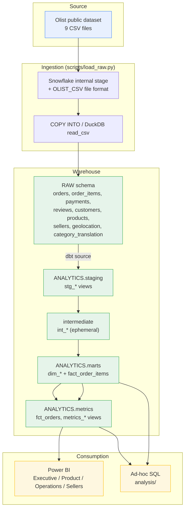

# Architecture

## End-to-end flow

## Warehouse layout

| Layer | Snowflake | DuckDB | Materialisation | Purpose |
|---|---|---|---|---|
| Raw | `RETAIL.RAW` | `retail.raw` | tables (loaded by script) | Olist CSVs, untransformed |
| Staging | `RETAIL.ANALYTICS_STAGING` | `retail.analytics_staging` | views | rename, cast, light clean — 1:1 with source |
| Intermediate | — (ephemeral) | — (ephemeral) | ephemeral CTEs | de-dupe reviews, aggregate payments |
| Marts / core | `RETAIL.ANALYTICS_MARTS` | `retail.analytics_marts` | tables | star schema: `dim_*`, `fact_order_items` |
| Metrics | `RETAIL.ANALYTICS_METRICS` | `retail.analytics_metrics` | views | reusable KPI logic for BI |

(dbt appends the `+schema` suffix to the target's base schema, e.g. target
schema `analytics` → `analytics_staging`.)

## Why these choices

- **Two targets, one codebase.** Snowflake is the production warehouse (the role
  this project targets uses it). DuckDB runs the identical models locally with
  zero credentials so tests and docs can be validated in CI and by a reviewer
  cloning the repo. All SQL uses portable constructs or dbt cross-DB macros
  (`dbt.datediff`, `dbt.type_numeric`, `dbt_utils.date_spine`).
- **Docker for dbt only.** The warehouse is not containerised — the local one is
  an embedded file, the cloud one is managed. Containerising it would add
  operational surface for no reproducibility gain. dbt itself *is* containerised
  because the host Python (3.14) is ahead of dbt's supported range.
- **Staging as views, marts as tables.** Staging is thin and always re-derivable;
  materialising it would just duplicate raw. Marts are queried repeatedly by BI
  so they are tables. Metrics are views on top of already-materialised marts.
- **Intermediate models are ephemeral** — they exist for readability
  (de-dup, pre-aggregation) and are inlined into the fact at compile time.
