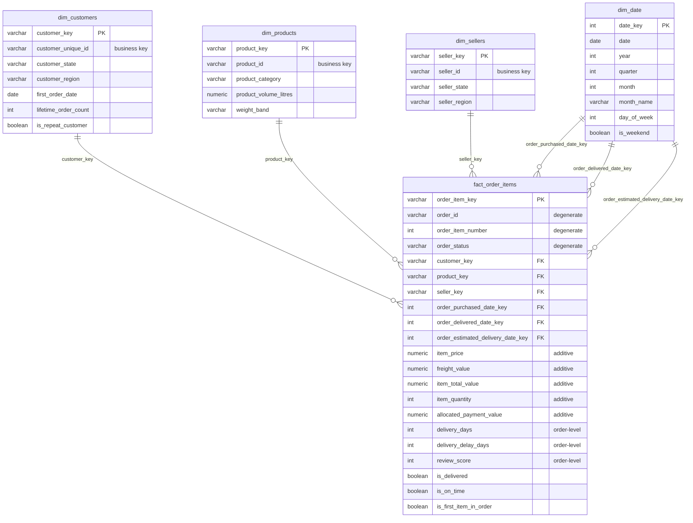

# Dimensional data model

## Star schema

## Fact grain

**`fact_order_items` = one row per order line item**, keyed by
`order_item_key = hash(order_id, order_item_id)`.

`order_item_id` in the source runs `1..n` within an order and also encodes
quantity: two units of the same product on one order appear as two rows
(`order_item_number` 1 and 2). So `count(*)` = items sold and
`sum(item_price)` = product revenue, both at line grain.

### Measure additivity

| Measure | Additive across… | Notes |
|---|---|---|
| `item_price`, `freight_value`, `item_total_value` | any dimension | core revenue measures |
| `item_quantity` (always 1) | any dimension | `sum` = items sold |
| `allocated_payment_value` | any dimension | order paid amount split across its lines by value share; ties back to the order within rounding |
| `delivery_days`, `estimated_delivery_days`, `delivery_delay_days` | **orders only** | identical on every line of an order; `avg` per order — filter `is_first_item_in_order` or aggregate via `fct_orders` |
| `review_score` | **orders only** | one review per order; same caveat |

### Fanout control

Every dimension join from the fact is many-to-one:

- one line → one product, one seller, one order → one customer;
- **payments** are pre-aggregated to order grain in `int_payments_by_order`
  (one row per order) before joining;
- **reviews** are de-duped to one row per order in `int_order_reviews`
  (latest review wins) before joining.

`assert_fact_not_fanned_out` enforces `count(fact) == count(stg_order_items)`
and `assert_revenue_reconciles_across_grains` enforces
`sum(line.item_price) == sum(order.product_revenue)`.

## Dimensions

### dim_customers — grain `customer_unique_id`
Olist issues a fresh `customer_id` per order and keeps `customer_unique_id`
stable per shopper. Building on the stable key is what enables repeat-purchase
analysis. `fact_order_items` links order → `customer_id` → `customer_unique_id`
→ `customer_key`.

### SCD treatment
All dimensions are **Type 1 (current value)**. Customer/seller location can
change between orders; we keep the value from the shopper's/seller's most
recent order. The dataset is a static historical extract, so no snapshot is
maintained. If this were a live feed, `dim_customers` location and
`dim_products` category would be the candidates for Type 2 history — a
`snapshots/` folder is scaffolded for that.

### dim_date — grain one calendar day
Generated with `dbt_utils.date_spine` over the `date_start`/`date_end` vars.
Supplies year, quarter, month (+ name), week, day, day-of-week, weekend flag.
