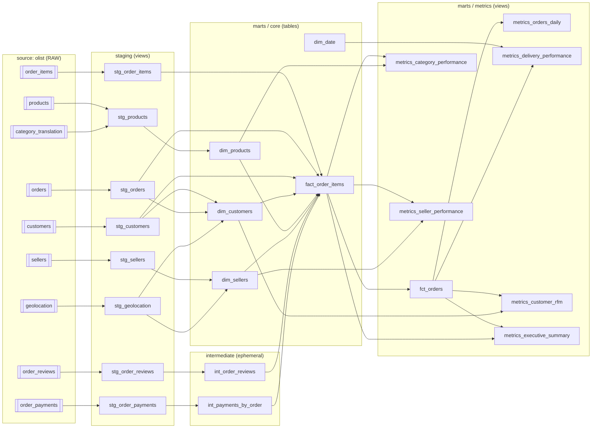

# dbt lineage

Browsable version: `make docs` then `docker compose run --rm --service-ports dbt dbt docs serve --host 0.0.0.0`
→ <http://localhost:8080> (the interactive DAG from `dbt docs generate`).

Static overview of the DAG:

